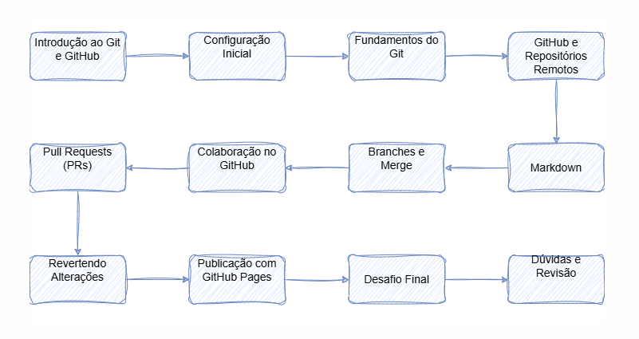

# 🚀 **Projeto Principal - Curso de Extensão** 📚

**Curso oferecido pela Universidade Santo Agostinho** 🎓  
**Foco Principal**: **Versionamento de Código com Git e GitHub** 💻  
**Professor**: Anderson Soares 👨‍🏫  
**Aluno**: Caio Alves de Aguiar Palacio 👨‍🎓

---

## 📖 **Descrição do Curso**

Este projeto foi desenvolvido como parte do curso de extensão oferecido pela Universidade Santo Agostinho, com o objetivo de **aprender e aplicar boas práticas de versionamento de código** utilizando **Git** e **GitHub**. Durante as aulas, tive a oportunidade de aprimorar minhas habilidades em:

- Controle de versões 🛠️
- Colaboração em equipe 🤝
- Integração de projetos 👩‍💻

Foi uma jornada fantástica que ampliou minha compreensão sobre o fluxo de trabalho em ambientes de desenvolvimento ágeis e distribuidos.

---

## 🗺️ **RoadMap do Curso**

Durante o curso, exploramos as seguintes etapas essenciais para dominar o Git e o GitHub:  
---

---

## 🛠️ **Tecnologias Utilizadas**

- **Git** - Controle de versão para o gerenciamento eficiente do código-fonte.
- **GitHub** - Plataforma de hospedagem de código-fonte que facilita a colaboração em projetos open-source.

## 🎯 **Objetivos do Projeto**

1. **Aprender Git**:  
   Entender como versionar código e colaborar de maneira eficiente em projetos de software. 👩‍💻
   
2. **Praticar GitHub**:  
   Compreender como utilizar repositórios remotos, colaborar com outros desenvolvedores e gerenciar contribuições em projetos open-source. 🌍

---

## ✨ **Destaques do Projeto**

- **Trabalho em equipe**: Em várias etapas, colaborei com colegas, revisando código, discutindo soluções e aplicando feedbacks.
- **Processos de Pull Request (PR)**: Aprofundei meu conhecimento no processo de revisão e integração de código em um repositório centralizado.
- **Resolução de conflitos**: Como lidar com conflitos de merge de forma eficiente e sem perder dados importantes!

---

## 🔗 **Links Importantes**  
[🔗 GitHub do Projeto](#)  
[🔗 Repositório do Curso](#)

---

**Aluno**: Caio Alves de Aguiar Palacio 👨‍🎓  
**Professor**: Anderson Soares 👨‍🏫  
**Universidade**: Santo Agostinho 🏫
